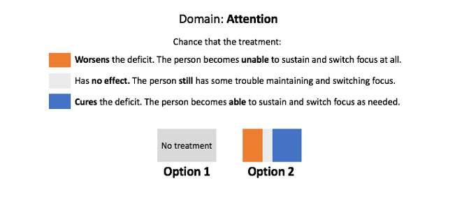

```{r setup, include=FALSE}
knitr::opts_chunk$set(echo = TRUE)
```

```{r load libs, include=FALSE}
library(readr)
library(dplyr)
library(ggplot2)
library(gridExtra)
library(knitr)
```


#Prompt:
Each group should turn in a one-page proposal for the project (Due May 6, 2020)

##a. Description of the problem:

I am interested in what drives the public’s attitudes towards neuromodulation technology. 

The public’s role in the dissemination of science tends to be crucial; their support funds our efforts and outrage constraints our avenue for expansion.  Nevertheless, we know little about what drives the public intuitions surrounding these particular technologies. It may be that public interprets the tradeoffs between risks of harm and the likelihood of gain by assessing the appropriate probabilities. Or perhaps people are relying on a set of more subjective probability estimates related to their personal experiences and values; we just don’t know what drives intuition about neurotechnology. 
Understanding what are the influences on an individual’s intuitions to endorse neurotechnology’s gives us leverage for designing and implementing policy that bolsters the public’s decision making competences thereby better aligning the mapping between what scientist actually know about neuromodulation efficacy, and what the public uses to make choices surrounding these technologies in both clinical and consumer settings.

-   Aim: To examine the influence of risk of harm on the public’s decisions to treat cognition with abstract techniques. 

My research group and I hypothesize that consistent with previous research on how people reason about the costs and benefits related to decisions under uncertainty, participants will be more averse to risks of harm than gain motivated when asked to treat cognition in others using abstract techniques. 
However, literature from moral psychology about decisions related to ethical issues in particular purport that people may be insensitive to the associated risks and benefits of concerning issue raised in the moral domain. Their decisions rather are driven by preexisting attitudes, what psychologist would sometimes call scared or protected values. 
I hypothesize that using a person ideological profile, we can predict whether they exploited a risk benefit calculation or exploited a more principle-based opposition when making treatment decisions about cognition in others using abstract techniques. 


##b. Description of the dataset:

```{r load data, fig.height=7, fig.width=12}
data <- read.csv("../data/Cleaned_Pilot.03.csv", header=TRUE, comment.char="#", stringsAsFactors=TRUE) %>%
    select(user_id, risk, gain, no_effect, experimental_treatment_selected, trial_index, 
           age, sex, education, race_ethnicity,
           ReligionRaised,ReligionNow, Religiosity, Spirituality, AttendChurch, 
           ReligiousActivity, meditation, 
           Harm,Fairness,Loyalty,Athority,Sancticy,
           POWER,ACHIEVEMENT,HEDONISM,STIMULATION,SELF.DIRECTION,
           UNIVERSALISM,BENEVOLENCE,TRADITION,CONFORMITY,SECURITY,
           Lying,Assasination,Torture,Murder,Stealing,ForcedSterilization)


tt2 <- ttheme_default()
grid.arrange(tableGrob(head(data[,1:6]), theme=tt2))
```

```{r figures, fig.align= 'center', fig.cap="Behavioral task example"}


```

Here we are using task data from a visual analog judgment task designed by our lab as well as a set of validated batteries and demographics gathered from an Mturk sample.
This is a data set that my research group and I have been gathering over Amazon mechanical Turk. It has two main components; Behavioral task data, and Qualtrics survey batteries. 
This is a between-subjects study with within-subjects responses to measures and demographic variables. There are seven variations of the task, one for each domain being assessed (attention (concentration), long term memory, short term (working) memory, mood, language (spoken), self-control, and motor function). For each task, a pair of boxes will be presented in sequential trials and the participant will be asked to select the one on the right or the left. The boxes will be given labels of the categories of cognitive dysfunction and use only grayscale, blue, and orange stimuli to be colorblindness compatible. In the figures below are an example of the task. 
Participants will be instructed that the amount of blue in the box is proportional to the likelihood that the cognitive deficit is removed. The amount of orange in the box is proportional to the probability that the cognitive deficit is doubled in severity. The amount of gray in the box is proportional to the probability that the treatment has no effect. For all tasks, the left-right orientation of stimuli will be counterbalanced across trials. Consistent with the design and sensitivity of behavioral economics paradigms at large, all tasks will begin with instruction slides followed by 75 trials separated by a simple fixation cross on screen for 200ms. The stimuli will remain on screen until the subject responds. Each trial will have a stimulus where the sum of the orange, gray, and blue is 100% of the rectangle. Each treatment will be associated with varying degrees of possible risk and gain on an interval from 0% to 100% with a random chance of no effect (i.e., ranging from a 0%-100% chance of doubling the deficit and a 0-100% chance of removing it, with the remainder being the chance it has no effect). See figure below for an example of the within subject manipulation. 
Due to time and subject fatigue constraints, the task will always be “anchored” to one cognitive stimulus category per subject. For instance, if a subject is assigned to the “Attention” condition, they will choose whether to give the treatment for Attention at different benefit and risk levels. 
Currently I have in total piloted about 100 subjects after my exclusion for careless responses. I will be launching a much larger data collection effort in the next few days for about 800 subjects.


##c. Supervised or unsupervised? Regression or classification?

This is a supervised machine learning project because we are using information about both the responses (task data) and a set of predictors (our survey data) to fit a model. Resampling techniques will be used to validate our model fit. To start, using the task data, we would first fit within subject logistic regressions (or maybe some other type of classifications method) and use the set of these outputs as to conduct a between subject analysis mapping the ideological data to the behavioral data.
As of now, I am on the fence as to which type, regression or classification, this problem is best conceptualized as.
For me it’s a matter of how to think about responses in a manner that best demonstrates individual’s insensitivity to risk and benefit tradeoffs.
We could:

-     use the betas from the classification 
-     use whether the model was significant or not for the particular subject as a binary


##d. Comments and/ or concerns.

I am still working on putting it all together, but I would apperciate if we could set up a meeting to further dicuss this. 